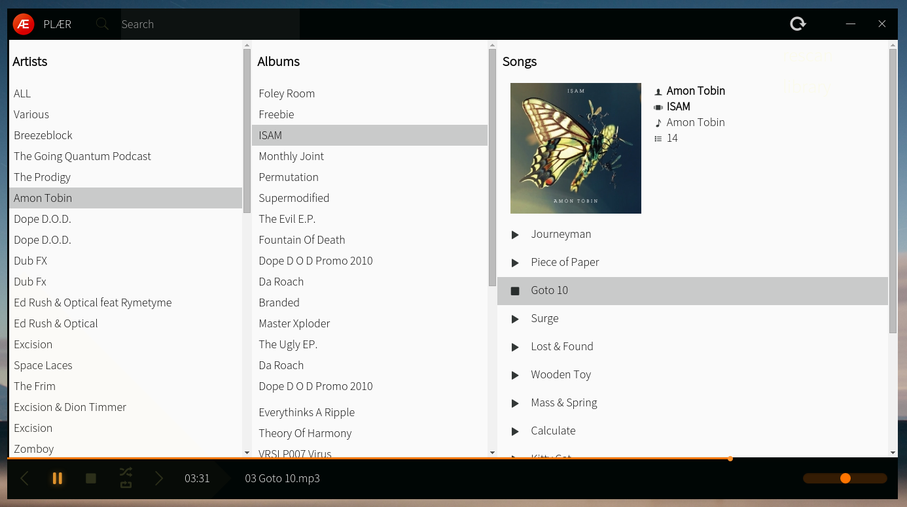

# PLAER
PLAER is a simple mp3 player that scan directory it is placed in to (**/some/dir/plaer** will scan **/some/dir**) and lets you browse and play founded mp3 files.


### Features
Basic features that should have every audio player.
- Play/Stop buddon
- Seek through playing audio
- View Artists thier Albums and songs

Nothing more and nothing less.

Build on nw.js, so it is just Java Script and HTML + CSS.

## Installation
Installation is not done yet, and for now, you need to:
- ```git clone git@github.com:vincurekf/plaer.git``` where you want the plaer to be (you can move it later though)
- Download [nw.js](https://github.com/nwjs/nw.js#downloads) and unpack it to the root folder
- On linux make nw executable (run from root folder) ``` sudo chmod +x ./nw```
- Run nw (or nw.exe on windows)
- Enjoy!

## Disclaimer
This app is not some proffesional solution, it works, can be easily changed and/or extended.
