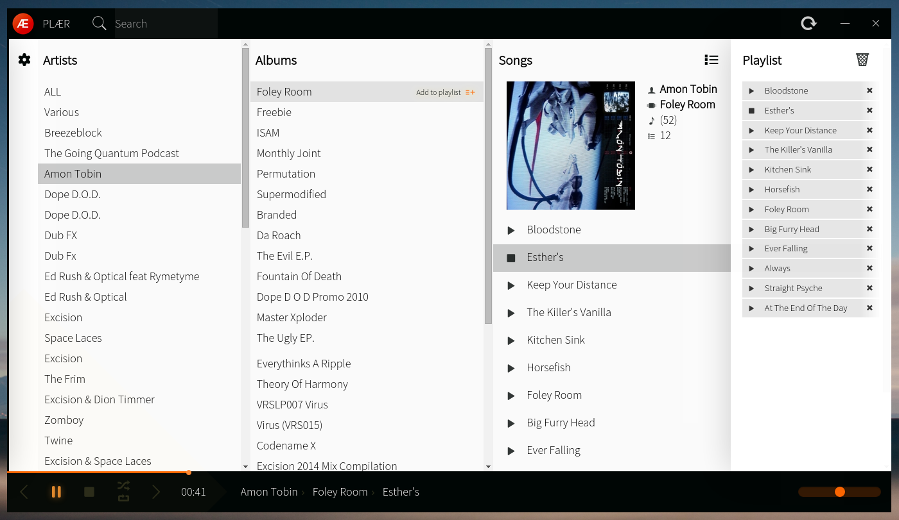

# PLAER
PLAER is a simple mp3 player that scans directory it is placed in (**/some/dir/plaer** will scan **/some/dir**) and lets you browse and play founded mp3 files.

Nothing more and nothing less.
Basic features that should have every audio player.

- Play/pause/stop, next and previous
- loop, shuffle
- seek through playing song
- view artists, their albums and songs
- automatically try to fetch and save album art via [iTunes search API](http://www.apple.com/itunes/affiliates/resources/documentation/itunes-store-web-service-search-api.html)
- notification of currently playing song

Nothing more and nothing less.

Build on nw.js (on v0.12.3, linux 64bit tested and working), so it is just Java Script and HTML + CSS.

## Installation
For running Plaer you need to have nodejs and npm installed. How to do that see [nodejs.org](https://nodejs.org/en/).

When you have nodejs and npm installed and working:

- ```git clone git@github.com:vincurekf/plaer.git``` where you want the plaer to be (you can move it later though)
- install node dependencies, run ```npm install``` in root directory
- Download [nw.js](https://github.com/nwjs/nw.js#downloads) and unpack it to the root directory
- On linux make nw executable (run as sudo) ``` sudo chmod +x ./nw```
- Run nw (or nw.exe on windows)
- Enjoy!

## Known flaws
When loading large files (~200mb) the app may become unresponsive or laggy.

## Used libraries
(TODO)

## Disclaimer
This app is not some proffesional solution, it works, can be easily changed and/or extended. It's just some thing, I use it at work to play files from USB stick.
